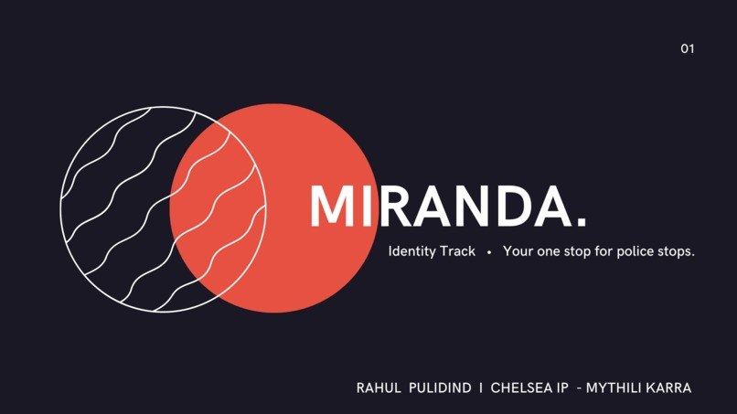
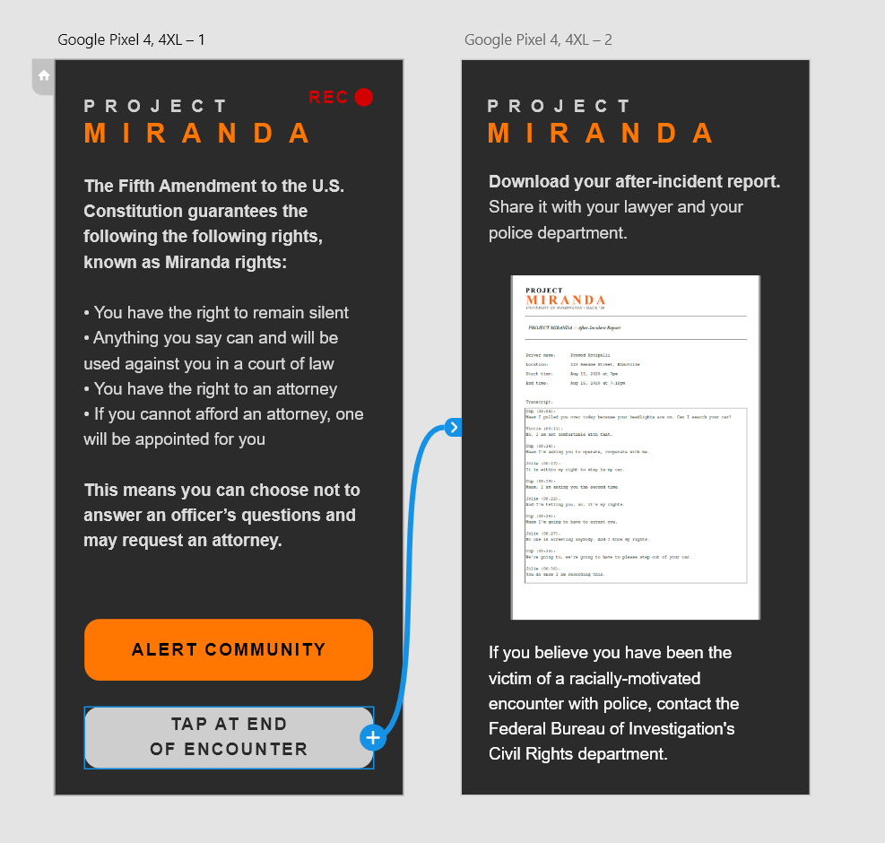

# MIRANDA

## :trophy: Best Use of Google Cloud @ Hack'20
## :trophy: Active Tooling Category Winner @ DuckHacks for Social Good

Your one stop for police stops. An app to counter police brutality.

## Demo

[YouTube demo](https://youtu.be/jtJp1VVpyNQ)

## Inspiration
As the Black Lives Matter movement becomes more prevalent and as police brutality case leakings skyrocket, it can be scary to get pulled over by a police and anticipate what the interaction will be like. According to the Stanford Open Policing Project, police officers make more than 50,000 traffic stops.

## What our app does
This is an app that documents and analyses police encounters using **Machine Learning** to help mitigate negative interactions with the police. Additionally, 'Miranda' promotes community policing by alerting nearby users and family.

## User Story
User: Innocent citizen being pulled over by the police

- When I see the flashing red and blue police lights in my rear-view mirror, I ask my phone “Hey Siri, I’m being pulled over.” The App “The one stop for police stops” opens up and automatically starts recording audio and video of this scene, streaming it to the cloud for secure storage. While the phone is recording the scene, my Constitutional and Miranda Rights are presented clearly on the app’s screen.

- I can tap a button (or the screen) to send a notification to my family and local concerned citizens that I’m being pulled over and may need help interacting with the police (e.g. recording the incident themselves).

- My incident report (including a transcript, the officer’s name, and the officer’s license plate) is published securely. Optionally, this incident can be posted on Twitter (with location + hashtags) to solicit help from other folks in the community, especially when there’s racist or aggressive language involved.

## How I built it
- Using **Google’s Speech Synchronous Recognition API**, audio files longer than 80 minutes can be transcribed successfully. 

- It can also be translated to different languages to fight police brutality in other countries (HK, a notable one). 
- The **NLP model** analyses the sentiments, comes up with a list of words with saliences attached. Judging from the relevance/how negative or positive it is, a loved one is able to encapsulate the situation quicker.

- Auto generates **PDF**. An actual log that went down during the whole interaction.

- With **Google’s Cloud Vision API**, our dash cam was able to screen capture the vehicle’s license plate. Printing each digit carefully into the full report, as a copy for the victim’s attorney/representative.

- Within Miranda, the app provides a comprehensive **list of commandments** the user is entitled to. IF the situation is aggravated, user can conveniently refer to it.

- As a form of protection, the app is designed to be completely black on the exterior. In case of confiscation, the user’s data will be saved and a full report will be ready for review.

- Our speech recognition can also detect screams/words highly categorized as “danger” — the app will contact the nearest bystander using a hashtag on twitter. A concept inspired by **Amber Alert**.

- We also used Twilio API to be able to send texts to friends and family if the user is in a dangerous situation

## Challenges I ran into
Some of us were new to working with APIs, so we had a bit of figuring out to do, but in the end everything worked smoothly. 

## Accomplishments that I'm proud of
We were able to integrate a lot of functionality in a short amount of time.

## What's next for MIRANDA
We plan on expanding and developing some of the functionalities of the app. For instance, we would like to integrate **AR/VR** in order to simulate a similar environment where you are pulled over by a cop and familiarize yourself with the actions you can take using this app. We also plan to use **Twitter API** to alert our community to flock to the location if the interaction is indicative of police brutality.
